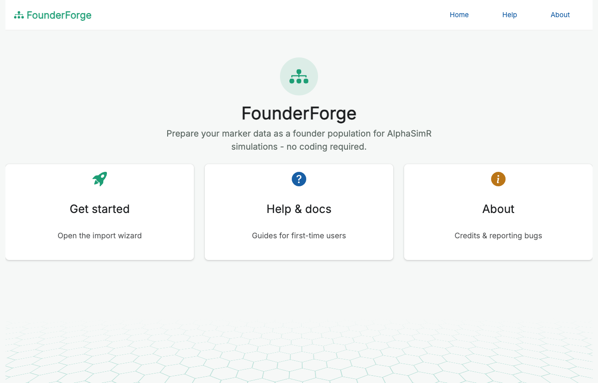
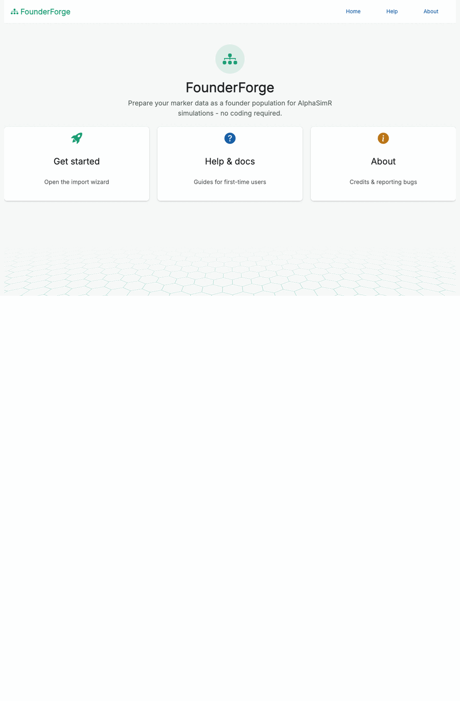
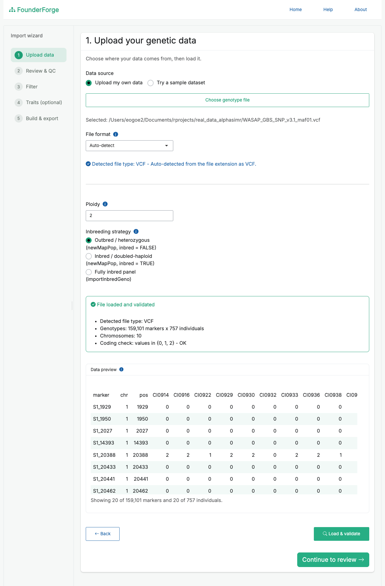
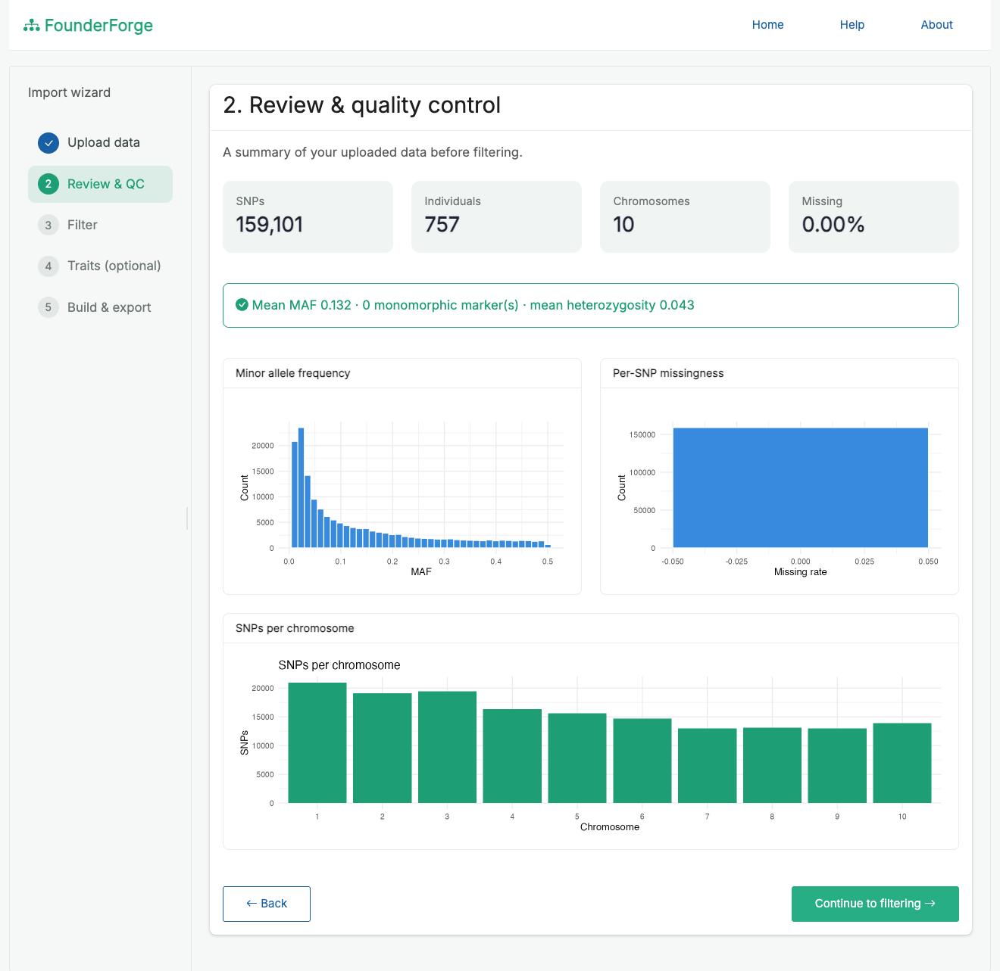
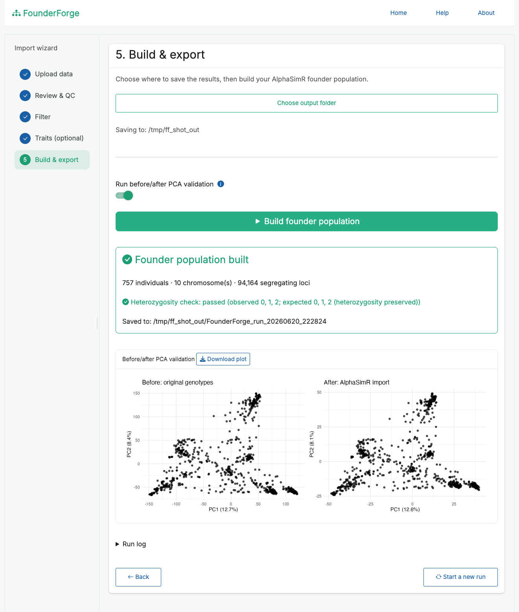

# FounderForge

<!-- badges: start -->
[](https://github.com/ebenogoe/FounderForge/actions/workflows/R-CMD-check.yaml)
[](https://lifecycle.r-lib.org/articles/stages.html#experimental)
[](https://opensource.org/licenses/MIT)
[](https://ebenogoe.r-universe.dev/FounderForge)
<!-- badges: end -->

**Prepare your marker data as a founder population for AlphaSimR simulations - no coding required.**

FounderForge is a point-and-click [Shiny](https://shiny.posit.co/) application
(built with the [golem](https://thinkr-open.github.io/golem/) framework and packaged
as an R package) that lets breeders, students and researchers prepare real marker data
as a founder population for [AlphaSimR](https://gaynorr.github.io/AlphaSimR/) simulations,
without writing any R.



---

## Overview

Starting an AlphaSimR breeding simulation from real data normally means hand-writing a
script to read your genotypes, quality-control and filter them, split them into
haplotypes, build a genetic map, and call `newMapPop()`. FounderForge wraps that whole
process in a guided wizard so a non-programmer can do it reliably, see what is happening
at each step, and get back exactly the objects AlphaSimR needs.

---

## Features

- Guided five-step wizard (upload → review → filter → traits → build & export).
- Multiple input formats with automatic format detection and validation.
- Quality-control dashboard: marker/individual counts, missingness, MAF, heterozygosity,
  and per-chromosome distribution, with plots.
- Flexible filtering: MAF, per-SNP and per-individual missingness, monomorphic-marker
  removal, minimum SNPs per chromosome, and dropping named individuals - with a live
  "markers retained" preview.
- Choice of import strategy (outbred, inbred/doubled-haploid, or `importInbredGeno`),
  each explained in plain language, so heterozygosity is handled correctly for your
  material.
- Optional additive-trait definition to also produce an AlphaSimR `SimParam`.
- Optional before/after PCA validation to confirm the import preserved population
  structure, with a downloadable plot.
- Organised, timestamped outputs plus a full text log of the run, including an explicit
  "assumptions and approximations" section.
- Helpful, specific error messages; progress feedback on every long-running step.
- Bundled sample datasets so you can try the app immediately.

---

## Supported file types

| Format | Extensions | Notes |
|--------|------------|-------|
| VCF | `.vcf`, `.vcf.gz` | Biallelic SNPs; the `GT` field is converted to 0/1/2. |
| HapMap | `.hmp.txt` | TASSEL-style nucleotide calls (two-character and IUPAC). |
| Numeric matrix | `.csv`, `.rds`, `.rdata` | A 0/1/2 dosage table with a marker map, or a saved `list(geno, snp_map)`. |
| PLINK | `.raw`, `.ped`/`.map` | `.raw` from `plink --recodeA`, or text `.ped` + `.map`. |

For wide numeric/HapMap-style tables, FounderForge auto-detects the chromosome, position
and marker-id columns (`chrom`, `pos`, `rs#`) and ignores standard metadata columns
(`alleles`, `strand`, `REFERENCE_GENOME`, etc.). Sample names with suffixes such as
`LINE1:FLOWCELL:LANE` can be cleaned with one click.

---

## How it works

1. **Upload** - choose your own file (or a bundled sample), pick the import strategy and
   ploidy. The detected file type and a validation summary are shown, with a scrollable
   preview of the first rows and columns.
2. **Review & QC** - inspect counts, missingness, MAF and per-chromosome marker
   distribution before changing anything.
3. **Filter** - apply MAF / missingness / monomorphic / chromosome-size filters and
   preview how many markers remain.
4. **Traits (optional)** - add additive traits (QTL per chromosome, mean, variance,
   heritability) to build a `SimParam`.
5. **Build & export** - choose an output folder, build the founder population, optionally
   run the PCA check, and save everything.

Under the hood: genotypes are normalised to a 0/1/2 matrix, missing calls are imputed,
each genotype is split into haplotypes (preserving heterozygosity for outbred material),
a per-chromosome genetic map is built (positions in Morgans, each chromosome starting at
0), and `AlphaSimR::newMapPop()` (or `importInbredGeno()`) is called.

---

## Screenshots

The full wizard, from welcome to a finished founder population (sped up):



Upload and validate your data, with a live preview and detected file type:



Quality-control review before filtering (counts, MAF, missingness, markers per chromosome):



Build the founder population and confirm the import with before/after PCA validation:



---

## Outputs and how they fit into AlphaSimR

Each run writes a timestamped folder:

```
FounderForge_run_<timestamp>/
├── founder_population/
│   ├── genmap.rds          # list of per-chromosome genetic maps (Morgans)
│   ├── haplotypes.rds      # list of per-chromosome haplotype matrices
│   ├── founder_pop.rds     # the AlphaSimR MapPop object
│   ├── sim_param.rds       # AlphaSimR SimParam (only if traits were defined)
│   └── rebuild_snippet.R   # the exact constructor call used, for reproducibility
├── qc/                     # qc_summary.csv and plots
├── validation/             # heterozygosity check, optional before/after PCA
└── logs/                   # full run_log_<timestamp>.txt
```

`genmap.rds` and `haplotypes.rds` are precisely the inputs to
`AlphaSimR::newMapPop()`; `founder_pop.rds` is the ready-to-use `MapPop`. To start a
simulation from a saved run:

```r
library(AlphaSimR)

founderPop <- readRDS("founder_population/founder_pop.rds")
SP         <- readRDS("founder_population/sim_param.rds")  # if you defined traits
# otherwise: SP <- SimParam$new(founderPop)

pop <- newPop(founderPop, simParam = SP)
# ... now cross, select, phenotype, etc.
```

`rebuild_snippet.R` reproduces the founder population from `genmap.rds` +
`haplotypes.rds`, so the import is fully auditable.

---

## Installation

Requires R (>= 3.5.0).

From [R-universe](https://ebenogoe.r-universe.dev/FounderForge) (prebuilt binaries, no
compiling - recommended):

```r
install.packages("FounderForge",
  repos = c("https://ebenogoe.r-universe.dev", "https://cloud.r-project.org"))
```

Or install from GitHub (builds from source; needs Rtools on Windows / Xcode on macOS):

```r
# install.packages("remotes")
remotes::install_github("ebenogoe/FounderForge")
```

Key dependencies (installed automatically): `AlphaSimR`, `vcfR`, `data.table`, `bslib`,
`bsicons`, `shinyFiles`, `shinyWidgets`, `shinybusy`, `DT`, `ggplot2`. `patchwork` is
suggested for the side-by-side PCA figure.

---

## Running the app

```r
library(FounderForge)
run_app()
```

FounderForge is designed to run locally so it can read large genotype files directly
from disk (via `shinyFiles`) and write outputs to a folder you choose.

---

## Sample data

Bundled example datasets (300 markers x 30 individuals, 3 chromosomes) ship in
`inst/extdata/` (`sample_numeric.rds`, `sample_numeric.csv`, `sample.vcf`,
`sample.hmp.txt`). Load them in one click from the upload page, or download them from the
**Help & docs** screen.

---

## Assumptions and limitations

- The genetic map assumes a uniform recombination rate (1 cM/Mb); supply a real map for
  accurate distances.
- For outbred imports, phasing of heterozygous sites is arbitrary (genotypes are split,
  not phased).
- QTL positions are placed at random by AlphaSimR; trait means, variances and
  heritabilities are user-supplied assumptions.

All of these are recorded in each run's log file.

---

## Reporting bugs

Please open an issue (or email ebenezerogoe@gmail.com) and attach the `logs/` file from
the affected run - it captures every step from import to export.

---

## Tests

```r
devtools::test()
```

---

## License

MIT (c) Ebenezer Ogoe. See `LICENSE`.
